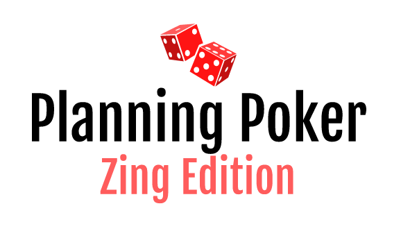

Planning Poker app previously developed.

TODO:
- [ ] Rework entire backend to Go
   - [ ] Implement Fetch Function
   - [ ] Find a way to broadcast message when value changes
- [ ] Dark Mode

# Planning poker


## Technologies :

Planning Poker uses a number of open source projects to work properly:

## Installation

Planning Poker requires Docker and Dev Containers in order to run.

Install the dependencies for the API

```bash
cd planning-poker-api
yarn
yarn start
```
Install the dependencies for the Client

```bash
cd planning-poker-client
yarn
yarn start
```

## Deployment

For production deployment, all you have to do is run the GitHub WorkFlow, it will

- Create a docker image for the api and client
- Upload it to Azure Container Registry
- Update the Web App to point to this new image

## Roadmap

While the initial release exhibits the core functionality of a planning poker application, there are some features that are yet to be added. These include, but are not limited to:

- Autodelete game after periods of inactivity
- Fallback moderator (if moderator disconnects, second person to join will be assigned moderator role for game to continue)

[//]: # (These are reference links used in the body of this note and get stripped out when the markdown processor does its job. There is no need to format nicely because it shouldn't be seen. Thanks SO - http://stackoverflow.com/questions/4823468/store-comments-in-markdown-syntax)

   [Socket.io]: <https://socket.io>
   [MongoDB]: <https://www.mongodb.com/>
   [React]: <https://reactjs.org/>
   [NestJS]: <https://nestjs.com/>
   [node.js]: <http://nodejs.org>
   [Typescript]: <https://www.typescriptlang.org/>
   [express]: <http://expressjs.com>
   [Redux/Redux Toolkit]: <https://redux.js.org/>
   [Prisma]: <https://www.prisma.io/>
   [Docker]: <https://www.docker.com/>

