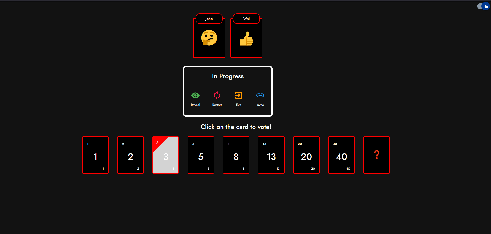
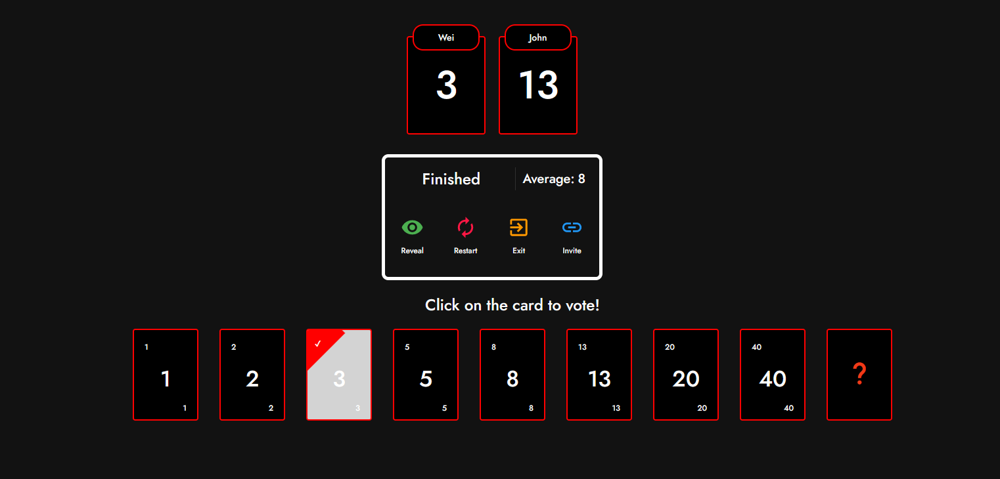

# Planning poker

## Technologies :

Planning Poker is an application that is used during the planning phase of a project to estimate the complexity of a task. It is a fun and interactive way to get the team involved in the planning process. This application is built using the following technologies:

- [React] - A JavaScript library for building user interfaces
- [Typescript] - A superset of JavaScript that adds static types to the language
- [Redux/Redux Toolkit] - A state management library for JavaScript applications
- [Go] - API built using Go
- [Postgres] - Database used to store user and game information

Example of the application:




## Installation

Planning Poker requires Docker and Dev Containers in order to run.

To use the API, refer to the [API README](planning-poker-go-api/README.md)

Install the dependencies for the Client

```bash
cd planning-poker-client
yarn
yarn start
```

## Deployment

For production deployment, all you have to do is run the GitHub WorkFlow, it will

- Create a docker image for the api and client
- Upload it to Azure Container Registry
- Update the Web App to point to this new image

## Roadmap

While the initial release exhibits the core functionality of a planning poker application, there are some features that are yet to be added. These include, but are not limited to:

- [x] Delete user and game after a day of inactivity
- [x] Fallback moderator (if moderator disconnects, second person to join will be assigned moderator role for game to continue)
- [x] Rework entire backend to Go
   - [x] Implement Fetch Function
   - [x] Find a way to broadcast message when value changes
- [x] Dark Mode (Currently working but need to apply to all the pages)
- [ ] Fix deployment and find a way to deploy to google lcoud
- [ ] Jest Testing (Try)
- [ ] Go API Testing?